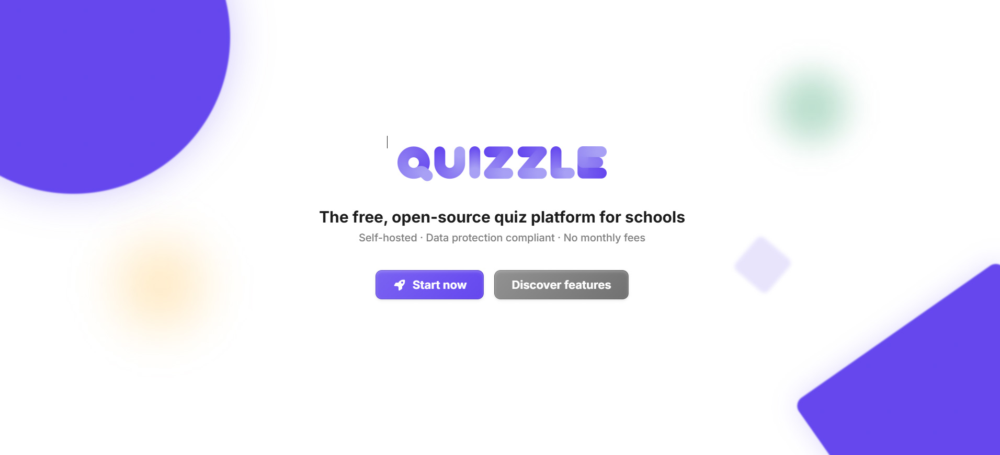
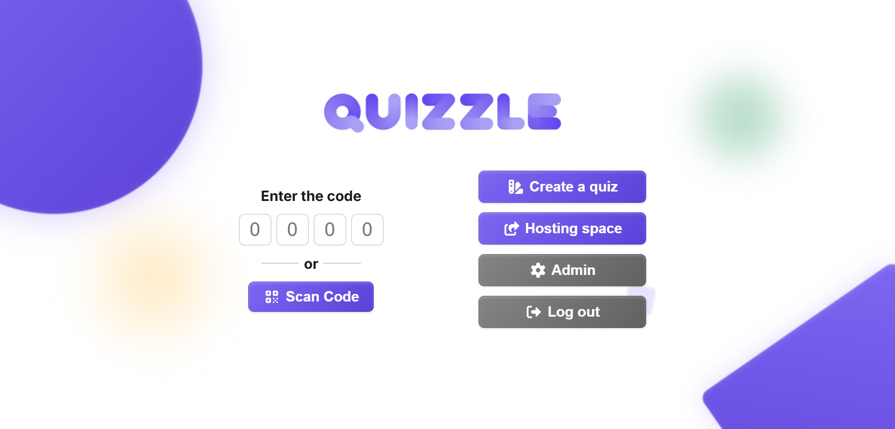

# Quizzle Main

## Overview

Quizzle Main is an AI-powered quiz and learning platform developed as part of a Senior IT Project.

The platform provides interactive quizzes, intelligent learning support, and a modern responsive interface to improve student engagement and learning experiences.

---

# Features

- Interactive quiz system
- AI-assisted learning experience
- Responsive modern UI
- Fast frontend performance
- Docker support
- Organized project architecture
- GitHub workflow integration

---

# User Personas

## 1. Student Learner

- Age: 18–25
- Goal: Improve knowledge through quizzes
- Needs:
  - Easy-to-use interface
  - Instant feedback
  - Interactive learning experience

## 2. Teacher / Instructor

- Goal: Create and manage quizzes
- Needs:
  - Organized question management
  - Student performance tracking
  - Efficient quiz creation

## 3. Competitive Quiz User

- Goal: Test knowledge and improve scores
- Needs:
  - Fast quiz sessions
  - Score comparison
  - Performance analytics

---

# User Scenarios

## Scenario 1 – Student Taking a Quiz

1. User opens the website
2. Selects quiz category
3. Starts the quiz
4. Answers questions
5. Receives score and feedback

## Scenario 2 – Teacher Managing Quizzes

1. Teacher accesses dashboard
2. Creates quiz questions
3. Assigns categories
4. Publishes quiz for students

## Scenario 3 – AI Assisted Learning

1. User completes a quiz
2. System analyzes weak areas
3. AI recommends practice topics
4. User improves through repeated learning

---

# Technologies Used

## Frontend

- React
- TypeScript
- Tailwind CSS
- Vite

## Backend / Tools

- Docker
- GitHub Actions
- Node.js

---

# Project Structure

```text
Quizzle-main/
│
├── .github/            # GitHub workflows
├── content/            # Project content
├── landing/            # Landing page
├── src/                # Main source code
├── public/             # Static assets
├── Dockerfile          # Docker configuration
├── package.json        # Dependencies
├── README.md           # Documentation
└── LICENSE             # License
```

---

# Installation

## Clone Repository

```bash
git clone https://github.com/YOUR_USERNAME/Quizzle-main.git
```

## Open Project Folder

```bash
cd Quizzle-main
```

## Install Dependencies

```bash
npm install
```

## Run Development Server

```bash
npm run dev
```

---

# Docker Setup

## Build Docker Image

```bash
docker build -t quizzle-main .
```

## Run Docker Container

```bash
docker run -p 3000:3000 quizzle-main
```

---

# Screenshots

## Home Page



## Quiz Page


## Dashboard



---

# System Architecture

```text
Frontend → API → AI Module → Database
```

---

# Challenges Faced

- Docker configuration
- Frontend optimization
- State management
- Responsive UI implementation
- GitHub integration

---

# Lessons Learned

- GitHub collaboration
- Docker deployment
- Modern frontend development
- Agile project workflow
- UI/UX design principles

---

# Future Improvements

- AI-generated quiz recommendations
- User authentication
- Leaderboard system
- Analytics dashboard
- Multi-language support

---

# Team Members

- Aswin Babu
- Anto Tom
- Bhaskar yadav

---

# License

This project was developed for educational purposes as part of the Senior IT Project.